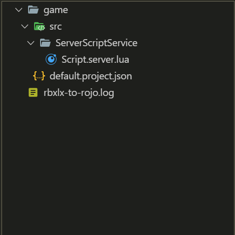

# rblx-to-rojo-2

[](https://github.com/Dark3581/rblx-to-rojo-2/actions/workflows/test.yml)

Convert an existing Roblox game into a [Rojo](https://rojo.space) project by reading its `.rbxl`, `.rbxlx`, `.rbxm` or `.rbxmx` file.

This is an **updated and maintained version of the original [rbxlx-to-rojo](https://github.com/rojo-rbx/rbxlx-to-rojo)** by Kampfkarren and the Rojo team. The original hasn't kept up with Roblox's file format and fails on places saved by current Studio. This version:

- opens files saved by current Studio
- fixes cases where the original silently lost or overwrote scripts
- is tested automatically on every change and every week (see [Testing](#testing))

## What's different from the original

| | Original | This version |
|---|---|---|
| Places saved by current Studio | Fails with `Decompression failed` or type-mismatch errors | Opens them (current `rbx-dom` libraries) |
| Two siblings with the same name, e.g. four models named `Light` that each contain a script | Merged into one folder; scripts overwrite each other with no warning | Parent is saved as a `.rbxm` model so every copy is kept, and a warning is logged |
| Names that can't be file names (`AC/Ban`, `init`, `CON`, `Helper.server`) | Crashes, or the script ends up in the wrong place | Written with a safe file name and mapped back to the real name in `default.project.json` |
| Disabled scripts, `RunContext`, attributes, tags | Lost | Kept in `.meta.json` files |
| Scripts inside services it doesn't export | Skipped with no message | Listed in a warning |
| Log file | Missed the first lines of every run | Has the whole run, with a summary of where every script went |
| Write errors | Crash | Reported, and the rest of the export carries on |
| Double-clicking the exe | Window closed before errors could be read | Waits for Enter |

## Download

Get `rbxlx-to-rojo.exe` from the [Releases](https://github.com/Dark3581/rblx-to-rojo-2/releases) page, or from the artifacts of the latest [Build](https://github.com/Dark3581/rblx-to-rojo-2/actions/workflows/build.yml) run. You can also [build it yourself](#building-from-source).

You need **Rojo 7** to use the output. It's tested with Rojo 7.7.0.

## Converting a game

1. In Studio, open your place and choose **File → Save to File As…** to save it as `.rbxl`.
2. Make an empty folder for the project.
3. Double-click `rbxlx-to-rojo.exe`, pick the `.rbxl` file, then pick the folder.

Or run it from a terminal:

```sh
rbxlx-to-rojo.exe MyGame.rbxl OutputFolder
rbxlx-to-rojo.exe --luau MyGame.rbxl OutputFolder   # write .luau instead of .lua
```

The project is written to `OutputFolder/MyGame/`, and the log to `OutputFolder/rbxlx-to-rojo.log`.



### What gets exported

Only **scripts**, plus the folders, models and services that contain them. Everything else stays in your place file: parts, UI, sounds and values. Every folder is marked `ignoreUnknownInstances`, so Rojo leaves those instances alone.

This means you should **keep working in your original place** and `rojo serve` into it. A place made from scratch with `rojo build` will have the scripts, but not the rest of the game.

### Special files you might see

| In the project | Why |
|---|---|
| `SomeModel.rbxm` | `SomeModel` has two or more children with the same name, which Rojo can't store as separate files. The whole model is saved as one `.rbxm` so nothing is lost. The scripts inside aren't plain text files, so rename the duplicates in Studio and re-run if you want to edit them. |
| `src/__named__/…` | A direct child of a service has a name that can't be a file name. It's written under a safe name here, and `default.project.json` gives it back its real name. |
| `src/__conflicts__/…` | Two children of a **service** have the same name. Services can't be saved as a `.rbxm`, so these are saved here and are **not synced**. Rename them in Studio and re-run. |

Check the log after each run. It lists every one of these, plus a summary line like this:

```
Scripts in place: 332 | written as files: 332 | inside .rbxm bundles: 0 | saved to __conflicts__ (not synced): 0 | in ignored services: 0
```

### Re-running into the same folder

Old files aren't deleted. If you've removed scripts in Studio since the last run, their files will still be there, and Rojo will sync them back. Delete the project folder first for a clean export. The tool warns you when the folder isn't empty.

## Troubleshooting

**`Decompression failed` or `rbx_binary didn't know what to do`**
Roblox changes the binary format from time to time. Make sure you have the latest build. As a workaround, save the place as `.rbxlx` (XML) and convert that.

**`Skipped Terrain.VoxelGridAssetContentMap (a newer property type …)`**
This is normal. Roblox adds new property types before the file reader supports them, and those properties are skipped. The log only says this for properties the export doesn't use, so nothing is lost. If an unsupported type ever turns up in something the export does use (script source, attributes, tags, `RunContext` or the enabled flag), it's logged as a WARN instead.

**Want more detail in the log?** Set `RUST_LOG=debug` before running.

## Building from source

Install a [Rust toolchain](https://rustup.rs/), then:

```sh
cargo build --release --all-features
```

The executable is `target/release/rbxlx-to-rojo.exe` (or `rbxlx-to-rojo` on macOS/Linux).

## Testing

This version is tested in three ways:

- **Automated tests** run on every push and pull request, and **every Monday** on a schedule, on Windows and Linux. The scheduled run also tests against the newest compatible versions of the Roblox file libraries, so a breaking upstream change shows up quickly. [See the latest runs](https://github.com/Dark3581/rblx-to-rojo-2/actions/workflows/test.yml).
- **Fixture tests** in [`test-files/`](test-files/) cover duplicate names, names that can't be file names, script properties, services, nested scripts, and real sample games. Each case has an expected output that the test compares against.
- **Round-trip checks on real places:** a game is converted, built back with Rojo, and every script is compared to the original (path, class, source, enabled state, `RunContext`, tags and attributes).

  Last verified on 2026-09-30 with Rojo 7.7.0 and five places saved by current Studio, 648 scripts in total: **every script matched.** On the same places, the original tool got 38 of 107 scripts wrong in one of them without any warning.

After `cargo test`, run it once more if any `test-files/*/output.json` was regenerated, so the second run checks against the new expected output.

## Credits

Based on [rbxlx-to-rojo](https://github.com/rojo-rbx/rbxlx-to-rojo) by [Kampfkarren](https://github.com/Kampfkarren) and contributors. This fork keeps it working with current Roblox files and fixes the problems above.

## License

Available under the Mozilla Public License, Version 2.0, the same as the original. See [LICENSE.md](LICENSE.md).
